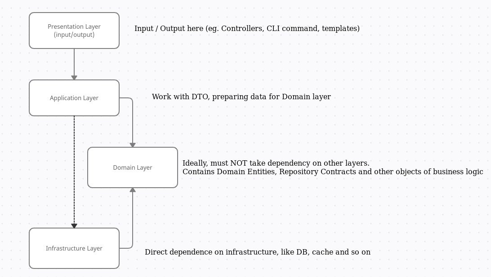

# "ToDo API" Microservice 

## Как запустить
Создать копию .env -> .env.local и заполнить данными

Запустить контейнеры docker compose --env-file .env.local up --build

## 

При реализации я придерживался основных принципов чистой архитектуры.

